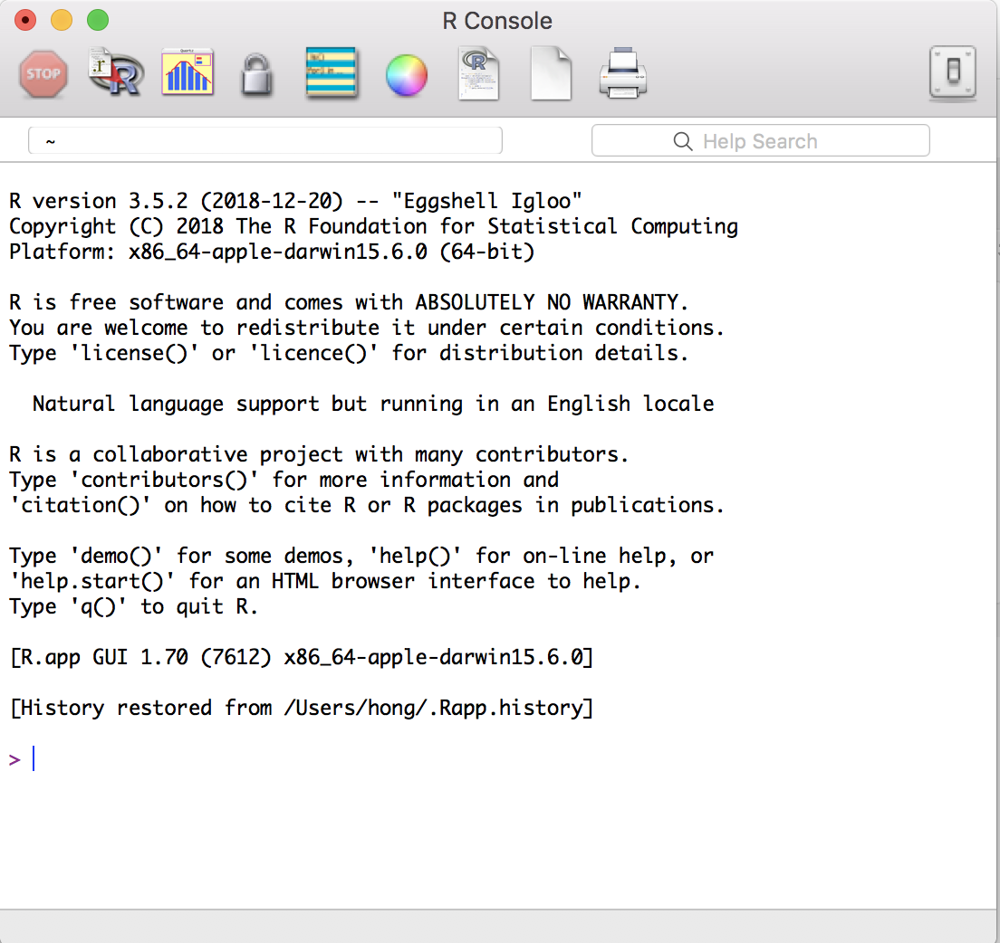
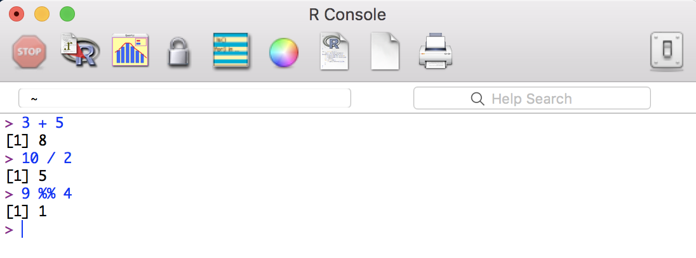

```{r, include=FALSE}
knitr::opts_chunk$set(collapse = TRUE)
```

## R & Rstudio  

우선 R이 뭔지 알아야겠죠? 다음 웹사이트를 방문해봅시다.   
https://www.r-project.org/about.html

Rstudio에 대해서도 알아봅시다.  
https://www.rstudio.com/products/rstudio/

[Note]   
R은 "통계와 그래픽을 위한 프로그래밍 언어와 환경" 정도로 이해하고, Rstudio는 R을 효과적으로 사용하게 해주는 통합개발환경(integrated development environment, IDE) - 쉽게 도구 - 라고 이해하시면 좋겠습니다. 

## R & Rstudio 설치하기  

R을 설치하는 것은 어렵지 않아요. 다음 웹사이트에 가서 R을 다운로드하고 설치합시다.  
The R Project for Statistical Computing https://www.r-project.org/    

Rstudio 설치도 간단합니다. 다음 웹사이트에 가서 Rstudio를 다운로드하고 설치합시다.   
An integrated development environment (IDE) for R https://www.rstudio.com/  

## R GUI

다음으로 R (GUI 프로그램)을 실행해봅시다.   
다음과 같은 화면이 나타날거예요. 


  
  
R은 간단한 계산기로 사용될 수 있습니다. 다음 산술 연산자를 사용해보세요.  

* Addition: +
* Subtraction: -
* Multiplication: *
* Division: /
* Exponentiation: ^
* Modulo: %%



<조교>      
[Basics of R](https://www.youtube.com/watch?v=SWxoJqTqo08&list=PLjgj6kdf_snYBkIsWQYcYtUZiDpam7ygg&index=1)

## 변수 
(통계) 프로그래밍의 기본 개념 중에 **변수(variable)**라는 것이 있습니다. 변수를 사용하여 값(Value) 또는 객체(Object)를 저장할 수 있습니다. 아직은 "객체"라는 것이 무엇인지 잘 모를텐데, 우선은 R에서 사용되는 모든 유형의 데이터 구조(data structure)를 지칭한다고 이해하시면 좋겠습니다 (이에 대해서는 아래에서 다시 설명합니다), 아무튼 여기서 중요한 것은 `변수`를 만든다는 것은 메모리의 일부 공간을 확보한다는 것입니다. 나중에 이 변수의 이름을 사용하여 이 변수에 저장된 값이나 객체에 접근할 수 있습니다.   

다음 명령을 사용하여 변수 my_var에 값 4를 할당할 수 있습니다. 

```{r}
my_var <- 4 # <- 대신에 = 를 사용할 수도 있습니다.   
my_var
```

## R의 기본 데이터 유형 (Basic data types)
R의 기본 data type은 다음과 같습니다. 

* Numerics (숫자)
* Integers (정수)
* Booleans (논리값, ex. TRUE or FALSE)
* Characters (문자, 문자열) 

<조교>  
[The basic data types in R](https://www.youtube.com/watch?v=hxlHQ2AtLUk&list=PLjgj6kdf_snYBkIsWQYcYtUZiDpam7ygg&index=2)

## 객체(Objects)
앞에서 객체에 대해 잠깐 언급하였는데, R에서 사용되는 객체, 즉 데이터 구조에는 다음과 같은 유형들이 있습니다. 이중에서 가장 기본적인 것이 Vector 입니다.  

* Vector 
* Factor 
* Matrix
* Data frame 
* List

[Note]  
참고로 array 라는 것이 있는데, matrix 는 2차원 array 를, vector 는 1차원 array 를 지칭합니다.    
 
## Vector  

### Create vector
Vector 를 만드는 방법 중에 대표적인 것은 combine 함수 [c()](http://www.rdocumentation.org/packages/base/functions/c)를 사용하는 것입니다. 괄호 사이에 쉼표로 구분된 벡터 요소(elements)를 배치합니다. 다음 예를 봅시다.   
```{r}
my_vec1 = c(2, 4, 6, 8)  
```

한 벡터 내의 요소들의 데이터 유형은 항상 같아야 합니다. 다음은 character vector 와 boolean vector 의 예입니다. 
```{r}
my_vec2 = c("apple", "orange", "banana", "grape")
my_vec3 = c(TRUE, FALSE, TRUE, FALSE)
```

<조교>  
[How to create and name vectors](https://www.youtube.com/watch?v=w5dOALbZ9HE&list=PLjgj6kdf_snYBkIsWQYcYtUZiDpam7ygg&index=3)

### Selecting vector elements (I)   
Vector 를 구성하는 elements의 position 을 index 라고 합니다.첫번째 요소의 index 는 1 입니다. index 를 이용해서 특정 elements 만 선택할 수 있습니다. 다음 예를 봅시다.  
```{r}
my_vec2[2] 
my_vec2[-2] # the second from the last 
my_vec2[c(1,3)] 
my_vec2[2:4] # from the second through to the 4th element
my_vec2[-c(2,4)] # exclude the 2nd and 4th elements 
```

### Selecting vector elements (II)   
square bracket 내에 boolean vector 를 사용해서 조건을 만족하는 elements 만을 선택할 수 있습니다. 다음 예를 봅시다. 
```{r}
my_vec1[my_vec1 == 6] # equal 
my_vec1[my_vec1 < 10] # less than 
my_vec1[my_vec1 %in% c(1, 2, 5)] # membership  
```


## Factor 
Factor는 vector의 한 형태인데, 제한된 수의 값을 요소로 취하는 R의 변수(객체)입니다. 따라서, factor는 범주형 변수입니다.   
```{r}
vec = c(1,2,3,1,1,2,2,3,2,3)
fvec1 = factor(vec) # convert numeric vector to factor  
fvec1 
```

factor 함수의 labels 라는 argument 를 사용해서 범주(levels)의 이름을 변경할 수 있습니다.  

```{r}
fvec2 = factor(vec, labels = c("mild", "moderate", "severe"))
fvec2 
```

levels() 함수를 이용해서 범주의 이름을 변경할 수도 있습니다. 
```{r}
levels(fvec1) = c("I", "II", "III")
fvec1
```

factor 함수는 기본적으로(default) numeric 에 대해서는 오름차순으로, character 에 대해서는 alphabet 순으로 levels를 정렬합니다. 상황에 따라 levels 의 순서를 새로 정의해주어야 할 필요가 생기는데, 다음 예를 봅시다. 
```{r}
mon = c("Jan", "Feb", "Jan", "Mar", "Feb", "Jan", "Jul", "Aug", "Nov", "Dec", "Apr", "May", "Jun", "Oct", "Sep")
fmon1 = factor(mon) 
fmon1
```

levels argument 를 이용해서 순서를 정해줄 수 있습니다. 
```{r}
fmon2 = factor(mon, levels = c("Jan", "Feb", "Mar", "Apr", "May", "Jun", "Jul", "Aug", "Sep", "Oct", "Nov", "Dec")) 
fmon2
```

서로 다른 범주를 묶어서 새로운 범주로 조직할 수도 있습니다. 
```{r}
levels(fmon2) = list(Spring = c("Mar", "Apr", "May"), 
                     Summer = c("Jun", "Jul", "Aug"),
                     Autumn = c("Sep", "Oct", "Nov"),
                     Winter = c("Dec", "Jan", "Feb")) # list 에 대해서는 아래에서 다룹니다. 
fmon2
```

<조교>  
[Using factors in R](https://www.youtube.com/watch?v=xkRBfy8_2MU)

## Matrix 
Matrix 는 2차원 array 입니다. 다음은 matrix 를 만드는 방법, 특정 행(row)이나 열(column), 요소(element)를 선별하는 방법, matrix의 전치(transpose)와 곱(multiplication) 연산자들의 사용예입니다. 
```{r}
# create a matrix from x
x = 1:12
mat = matrix(x, ncol = 3)
# select rows/columns/elements
mat[1,]
mat[,3]
mat[3,2]
t(mat) # transpose 
mat %*% t(mat) # matrix multiplication
```

<조교>  
- [How to create and name matrices in R](https://www.youtube.com/watch?v=O7KL17QZNqg)    
- [Matrix arithmetic in R](https://www.youtube.com/watch?v=GuZQZDCz4hA)    
  
  
## List
List는 일반 벡터형 객체입니다. 요소로 여러 유형의 데이터구조 - 즉 벡터, matrix, 혹은 다른 list 등 - 를 포함할 수 있습니다.   
List 객체는 list() 함수로 생성합니다.  
다음 예는 숫자형 벡터와 문자 벡터를 각각 첫번째와 두번째 요소로 갖는 list 객체를 만드는 예입니다. 
```{r}
lst <- list(1:5, c('a', 'b'))
names(lst) <- c("x", "y") # name list elements (vector에서의 element naming 방식과 동일합니다.)
```

List에서 특정 elements를 selection하는 방법은 아래와 같습니다. Return 값이 list라는 것에 주의해야 합니다. 
```{r}
lst[1] # select elements by position (indexing)
lst["y"] # select elements by name
```

만약, return 값을 list가 아닌 해당 elements의 데이터구조로 받고자 한다면, 다음과 같이 double square brackets[[]]를 사용하거나 $ 연산자를 사용해야 합니다.  
```{r}
lst[[1]]  
lst$x
```

<조교>     
[How to create and name lists in R](https://www.youtube.com/watch?v=Px9VNWHja4M)


## Data frame
<조교>     
[Using the data frame in R](https://www.google.com/search?q=data+frame+in+r&oq=data+frame+in+r&aqs=chrome..69i57j69i60j0l4.4660j0j7&sourceid=chrome&ie=UTF-8#kpvalbx=1)

data frame은 기본적으로 list의 elements를 column-wise 조직한 데이터구조입니다. list와 다른 점은 matrix와 같은 배열 구조를 가지고 있다는 것과, 각 elements(data frame에서는 columns)의 길이가 같아야 한다는 것입니다.   
data.frame() 함수를 이용해서 생성합니다. 
```{r}
name = c("Kim", "Park", "Lee")
age = c(30, 38, 42)
child = c(TRUE, FALSE, TRUE)
df <- data.frame(name, age, child)
df
```

data frame의 행(row), 열(column), 특정 원소를 selection하는 방법은 아래와 같습니다.  
```{r}
df[1,]
df[3,2]
df[,1:2]
```

다음은 data frame의 구조, 크기, 요약 함수입니다.  
```{r}
str(df)
dim(df)
summary(df)
```

## Programming  
프로그래밍은 기본적으로 순차진행, 반복문, 조건문으로 이루어집니다. 다음은 반복문과 조건문을 작성하기 위한 R의 문법입니다.    

반복문 for loop 
```{r}
# summation 1 to 10
j = 0
for (i in 1:10){
  j = i + j
}
j
```

<조교>     
[Working with for loops in R](https://www.youtube.com/watch?v=gSliFLjH3OI)

반복문 while loop
```{r}
i = 0; j = 0
while (i < 10){
  i = i + 1
  j = j + i
}
i; j
```

[Note]
for loop vs. while loop   
차이점이 보이시나요?   
for: execute a loop a fixed number of times
while: execute a loop while a condition is true

조건문  
if... else... 
```{r}
if (i > 3){
  print("i larger than 3")
} else {
  print("i less than 3")
}
```

## 함수(Functions)
프로그래밍을 하다보면 반복적으로 하게 되는 작업이 있습니다. 함수를 사용하면 이러한 작업을 위해 매번 같은 코드를 작성할 필요가 없어집니다.  
먼저 R에는 기본적으로 자주 사용되는 함수들이 내장되어 있습니다. 다음은 몇 가지 내장 함수들의 예입니다.  

```{r}
# create vectors
seq(2, 10, by=0.5)  
rep(1:3, times=3); rep(1:3, each=3) 
x <- c(10:20, 1, 3, 10, 12) # c() 도 함수입니다. 
# sorting 
sort(x); sort(x, decreasing = TRUE) # argument, 함수의 실행 방식을 특정하는 변수(parameter) 값이라고 알아둡시다.   
rev(x)
# summary
length(x); range(x)
table(x) # vounts of values
# subset
unique(x) # unique values
# Math functions 
sum(x)
mean(x); median(x)
max(x); min(x)
round(1.8734, 2)
exp(x)
```

### 사용자 정의 함수 만들기(User-defined function) 
필요에 따라 함수를 새로 만들어서 사용하기도 합니다. 다음은 어떤 값의 제곱값을 계산하는 함수를 만드는 예입니다.   
```{r}
square = function(x){
  squared = x*x
  return(squared)
}
square(4)
4^2 # 물론 이렇게 하면 됩니다. ^^ 
```

<조교>       
[Writing functions in R](https://www.youtube.com/watch?v=M4fMccWy5lU)  


## Environment
다음은 작업공간(working directory) 설정, R 객체의 조회와 제거, 도움말에 대한 함수입니다. 
```{r}
getwd() # setwd() 
ls() # list R objects
rm(i) # remove R objects
?ls
```

## 데이터 불러오기
데이터 가공, 통계, 그래픽 등 작업을 위해 외부 데이터를 불러들이는 방법에 대해서 알아봅니다.  
```{r}
# read a comma separated value (csv) file
demograph = read.csv("Demographic.csv") # csv 파일을 data frame 으로 불러들입니다. 
head(demograph) # show the first 6 rows
```

다음은 일반 text 파일을 불러들이는 함수입니다. 
```{r}
# read a delimited text file 
proact = read.delim("proact_sample.txt", sep="|") # sep은 delimiter를 가리키는 argument 입니다.  
# proact_sample.txt: random 1/20 sample of the PROACT dataset
str(proact)
```

## 데이터 쓰기
R에서 생성하거나 가공한 data frame 등의 데이터구조 객체를 파일로 외부에 저장하는 방법입니다.  
```{r}
demograph$Age = round(demograph$Age) # demograph 데이터프레임에서 Age 변수(column name) 값을 소수점 반올림합니다. 
write.csv(demograph, file = "demograph_roundage.csv", row.names = F, quote = F) 
write.table(demograph, file = "demograph_roundage.txt", quote = F, row.names = F)
```

## 그래프 
그래프는 탐색적 데이터 분석을 위한 매우 훌륭한 도구입니다. 우선 가장 기본적인 그래프인 scatter plot, histogram, bar plot, box plot 에 대해서 간단히 살펴봅시다.   

### Scatter plot  
```{r}
alsfrs = read.csv("ALSFRS.csv")
attach(alsfrs)
plot(alsfrs.slope.before3mo, alsfrs.slope.after3mo)
```

### Histogram
```{r}
hist(demograph$Age)
hist(demograph$Age, freq = F)
plot(density(demograph$Age))
```

### Bar Plot 
```{r}
counts <- table(demograph$Gender)
barplot(counts, main="Gender", 
  	xlab="Number of patients")
```

### Boxplot  
```{r}
boxplot(Age~Gender,data=demograph)
```

<조교>    
- [Making basic graphics in R](https://www.youtube.com/watch?v=UXeJ1bNYCos)  
- [How to plot multiple graphs in R](https://www.youtube.com/watch?v=Z3V4Pbxeahg)  
- [Customizing your plots in R](https://www.youtube.com/watch?v=0MrYVzPxBIc)  

  

