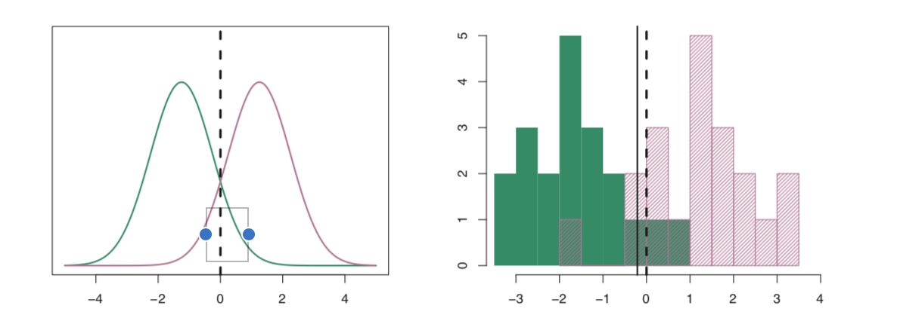

```{r, include=FALSE}
knitr::opts_chunk$set(collapse = TRUE)
```

# Basic concepts of statistics & statistical modeling  

우리는 표본의 정보를 사용하여 모집단의 특징을 추정할 수 있습니다. 예를 들어, 어떤 변수 Y의 모평균 $\mu$를 알고자 한다고 해봅시다. 유감스럽게도 $\mu$는 알려져 있지 않습니다. 그러나, 우리는 Y의 n개 관측치, $y_1$, $y_2$, ..., $y_n$를 알수 있고,  이를 사용하여 $\mu$를 추정할 수 있습니다. 즉, 아래와 갈이 표본평균을 모평균(정확히 말하면 모평균의 추정치)으로 합리적으로 추정할 수 있습니다. 

$$\hat{\mu}=\overline{y}$$

그럼, 표본평균은 모평균의 추정값으로 얼마나 정확한가요?   
일반적으로 이 질문에 대한 답은 표준 오차(standard error)를 계산하는 것입니다. 표준 오차는 추정치(여기서는 모평균의 추정치가 되겠네요)의 표준 편차입니다. 즉, 표본 평균의 표준 편차, 이것이 표준 오차이며 잘 알려진 식은 아래와 같습니다.   

$$SE = \frac{\sigma}{\sqrt{n}}$$
$\sigma$: 표본 표준 편차 
$n$: 관측치의 개수  

[Standard error & bootstrapping]  
[standard error and bootstrapping](https://www.youtube.com/watch?v=XNgt7F6FqDU)

표준 오차는 신뢰구간을 계산하는데 사용될 수 있습니다. 
[동영상]   
[confidence interval](https://www.youtube.com/watch?v=TqOeMYtOc1w)  

# 선형 회귀(linear regression)

기계학습의 가장 단순한 기법인 선형 회귀에 관한 것을 먼저 살펴보겠습니다.   

선형 회귀는 나중에 소개할 최근의 기계학습 기법만큼 흥미롭지 않을 수도 있지만, 여전히 유용하고 자주 사용되는 방법입니다. 사실 많은 기계학습 기법이 선형회귀의 일반화 혹은 확장으로 볼 수 있습니다. 따라서, 더 복잡한 기계학습 기법에 대해 학습하기 전에 선형회귀에 대해 잘 이해하는 것이 매우 중요합니다.   

[Linear model: least squares, residuals, R^2, F-statistic ](https://www.youtube.com/watch?v=nk2CQITm_eo)

[Challenges]   
먼저 gapminder 자료를 기억해봅시다.  

1. gapminder 데이터에서 기대수명은 일인당 국민소득과 연관이 있다고 말할 수 있을까요?    

2. 일인당 국민소득과 기대수명의 관계를 선형 모델로 설명할 때, 선형모델은 두 변수간의 관계를 얼마나 잘 설명할 수 있을까요?   

3. 우리는 선형모델을 이용해서 일인당 국민소득으로 기대 수명을 얼마나 정확하게 예측할 수 있을까요?  

```{r message=FALSE}
library(gapminder)
library(dplyr)
library(ggplot2)
```


```{r}
gapminder_1952 = gapminder %>%
  filter(year == 1952) %>%
  mutate(gdpPercap_log = log10(gdpPercap))
```

```{r}
ggplot(gapminder_1952, aes(gdpPercap_log, lifeExp)) + geom_point()
```

```{r message=FALSE}
attach(gapminder_1952)
```

linear model을 적합시키는 함수로 lm()을 사용합니다.  
```{r}
lm.fit = lm(lifeExp ~ gdpPercap_log)
```

model fit의 결과를 보기위해 summary() 함수를 사용합니다.   
```{r}
summary(lm.fit)
```

### 1. gapminder 데이터에서 (1952년) 기대수명은 일인당 국민소득과 연관이 있다고 말할 수 있을까요? (Is there relationship?)   

위 질문에 답하기 위해 우리는 다음 두 가지를 하였습니다.  
1. fit a linear model 
2. test the hypothesis: $\beta_x$ = 0 

위 2번 가설 검정에 t-statistic 을 사용하였습니다. t statistic formula 는 아래와 같습니다.   
$$t=\frac{\overline{x}-\mu_o}{SE}$$
$\overline{x}$: sample mean (sample coefficient in linear regression)
$\mu_0$: population mean (population coefficient in linear regression)
SE: standard error (of the coefficient in linear regression)  


###2. 일인당 국민소득과 기대수명의 관계를 설명하는데 어떤 모델이 적합할까요? 선형 모델로 그 관계를 얼마나 설명할 수 있을까요? (Is the relationship linear?)  

$$R^2 = \frac{TSS - RSS}{TSS}$$  
- $R^2$: the proportion of the total variation explained by the fit (regression model) 
- TSS: Total sum of squares (aka, SS around the mean)
- RSS: Residual sum of squares (aka, SS around the fit)  

[Note]    
*How different is the multiple R-squared from the Adjusted R-squared?*    
The adjusted R-squared is a modified version of R-squared that has been adjusted for the number of predictors in the model. The adjusted R-squared increases only if the new term improves the model more than would be expected by chance. It decreases when a predictor improves the model by less than expected by chance. It is always lower than the R-squared.   

F-statistic  
: the variance explained by the fit **divided by** the variance not explained by the fit 

###3. 우리는 선형모델을 이용해서 일인당 국민소득으로 기대 수명을 얼마나 정확하게 예측할 수 있을까? (Can we predict accurately?)   

앞에서 1952년 데이터를 이용해서 일인당 국민소득(정확히는 로그변환한)에서 기대수명을 예측하는 단순선형모델을 만들었습니다. 기대수명은 일인당 국민소득과 유의한 상관관계가 있으며, 단순 선형모델의 $R^2$는 0.56, 즉 기대수명 변동의 56%가 이 모델로 설명된다는 것을 확인하였습니다. 

이제, 1952년 데이터를 이용해 학습시킨 이 단순회귀 모델을 이용해 2002년 기대수명을 예측해봅시다.   

```{r}
gapminder_2002 = gapminder %>%
  filter(year == 2002) %>%
  mutate(gdpPercap_log = log10(gdpPercap)) %>%
  select(lifeExp, gdpPercap_log)
```

예측값의 산출을 위해 predict() 함수를 사용합니다. 
```{r include=FALSE}
pred = predict(lm.fit, gapminder_2002)
```

예측값과 실제 관측값이 얼마나 다른지 살펴봅시다.   
```{r}
df = data.frame(observation = gapminder_2002$lifeExp, prediction = pred)
ggplot(df, aes(observation, prediction)) + geom_point() + geom_abline(slope = 1, intercept = 0)
```


회귀모델의 예측 정확도를 나타내는 정량 지표로 RMSE (Root mean squared error)를 사용합니다. 

MSE = variance = average SS not explained by the fit 
```{r}
rmse = function(x){
  sqrt(sum((residuals(x)^2))/df.residual(x))
} # x = lm.fit 
```

```{r}
rmse(lm.fit) # gapminder_1952
rmse(lm(observation ~ prediction, df)) # gapminder 2002
```

Confidence interval을 구해봅시다.  
```{r include=FALSE}
predict(lm.fit, gapminder_2002, interval ="confidence")
```


## Potential problems in linear regression  

### 1. Non-linearity of the data
> Is the relationship linear?

```{r}

plot(lstat, medv)
abline(lm.fit)
```

```{r}
# diagnostic plots
par(mfrow=c(2,2))
plot(lm.fit)
```

```{r}
# linearity
# residual plots
plot(predict(lm.fit), residuals(lm.fit))
plot(predict(lm.fit), rstudent(lm.fit))
abline(h=c(-3,3))
```

***   
**Note**  
Residual plots are a useful graphical tool for identifying non-linearity. The standardized (or studentized) residuals, computed by dividing each residual by its estimated standard error. If the residual plot indicates that there are non-linear associations in the data, then a simple approach is to use non-linear transformations of the predictors, such as logX, √X, and X^2, in the regression model.   

***    

> How can we improve the model? 

1. Polynomial  
2. Multiple  

polynomial linear regression  
```{r}
lm.fit2 = lm(medv ~ lstat + I(lstat^2))
summary(lm.fit2)
anova(lm.fit, lm.fit2)
# plot
library(ggplot2)
ggplot(Boston, aes(lstat, medv)) + geom_point() + 
  stat_smooth(method = "lm", col="blue") +
  stat_smooth(method="lm", formula = y ~ poly(x, 2), col="red")
```


multipe linear regression  
```{r}
lm.fit3 = lm(medv ~ lstat + age, data = Boston)
summary(lm.fit3)
lm.fit4 = lm(medv ~ ., data = Boston)
summary(lm.fit4)
```


### 2. Correlation of error terms 
<br>
If in fact there is correlation among the error terms, then the estimated standard errors will tend to underestimate the true standard errors. Such correlations frequently occur in the context of time series data, which consists of observations for which measurements are obtained at discrete points in time. In many cases, observations that are obtained at adjacent time points will have positively correlated errors. Many methods have been developed to properly take account of correlations in the error terms in time series data.


### 3. Non-constant variance of error terms 
<br>
One can identify non-constant variances in the errors, or heteroscedasticity, from the presence of a funnel shape in
the residual plot.
When faced with this problem, one possible solution is to trans-
form the response Y using a concave function such as log Y or $\sqrt{Y}$ . Such a transformation results in a greater amount of shrinkage of the larger responses, leading to a reduction in heteroscedasticity.


### 4. Outliers 
<br>
If we believe that an outlier has occurred due to an error in data collection or recording, then one solution is to simply remove the observation. However, care should be taken, since an outlier may instead indicate a deficiency with the model, such as a missing predictor.

### 5. High leverage points  
<br>
Observations with high leverage have an unusual value for $x_i$


### 6. Collinearity  
<br>
Collinearity refers to the situation in which two or more predictor variables are closely related to one another. The presence of collinearity can pose problems in the regression context, since it can be difficult to separate out the individual effects of collinear variables on the response. Since collinearity reduces the accuracy of the estimates of the regression coefficients, it causes the standard error for $\hat{β}_j$ to grow. 

***
**Note**   
A simple way to detect collinearity is to look at the correlation matrix of the predictors. Instead of inspecting the correlation matrix, a better way to assess multi-collinearity is to compute the variance inflation factor (VIF). 

$$VIF = \frac{var(\hat{β}_j)_f}{var(\hat{β}_j)_u}$$$ 
- f: full model  
- u; univariate model 
   
As a rule of thumb, a VIF value that exceeds 5 or 10 indicates a problematic amount of collinearity.   

***
<br>

```{r}
library(car)
vif(lm.fit4) # variance inflation factor
# vif, cut-off for collinea rity
# what would be the solution for collinearity problem? 
lm.fit = update(lm.fit, ~. -age)
summary(lm.fit)
```


## Other considerations 

### 1. interaction terms 


```{r}
lm.fit = lm(medv ~ lstat*age, data = Boston)
ggplot(Boston, aes(lstat, medv, col = age)) + geom_point()
Boston$age_gr = cut(Boston$age, breaks = c(0,40,80,100), include.lowest = T, right = F)
levels(Boston$age_gr)
ggplot(Boston, aes(lstat, medv, col = age_gr)) + geom_point() + stat_smooth(method = "lm", se = F)
```

### 2. Qualitative predictors 

```{r}
Boston$chas = factor(Boston$chas)
lm.fit5 = lm(medv~., data = Boston)
summary(lm.fit5)
contrasts(Boston$chas) # dummy variables 
```


# 분류(classification)   

classifier: assign a probability to each class  

> Examples of classification problem... 을 생각해보자... 

## logistic regression 

Logit function  
$$P(X) = \frac{e^{\beta_0+\beta_1X}}{1+e^{\beta_0+\beta_1X}}$$

Odds   
$$\frac{P(X)}{1-P(X)} = e^{\beta_0+\beta_1X}$$
**odds: P(event)/P(nonevent)** 


Logit 
$$log(\frac{P(X)}{1-P(X)}) = \beta_0 + \beta_1X$$ 

> titanic survival classification    

```{r}
library(carData)
head(TitanicSurvival)
str(TitanicSurvival)
summary(TitanicSurvival)
```

```{r}
TitanicSurvival = TitanicSurvival[complete.cases(TitanicSurvival),]
```

fit logistic regression model   
```{r}
glm.fit = glm(survived ~., data = TitanicSurvival, family = "binomial")
```

```{r}
summary(glm.fit)
coef(glm.fit)
```

odds  
```{r}
exp(coef(glm.fit)[2])
```
male 인 경우 female 에 비해서, 생존/죽음 odds가 0.08배 (즉, 훨씬 낮다, 10배 이상), Odds ratio 개념... 


dummy variables  
```{r}
contrasts(TitanicSurvival$survived)
contrasts(TitanicSurvival$passengerClass)
```

prediction 
```{r}
glm.probs = predict(glm.fit, type = "response")
```

confusion matrix   
accuracy  
```{r}
glm.pred = rep("no", 1046)
glm.pred[glm.probs>0.5] = "yes"
table(glm.pred, TitanicSurvival$survived)
mean(glm.pred == TitanicSurvival$survived)
```

test error rate
```{r}
set.seed(1)
index = sample(1:1046, round(1046/7), replace = F)
train.glm = TitanicSurvival[index,]
test.glm = TitanicSurvival[-index,]
```

fit the model wit training data, and predict in test data
```{r}
glm.fit = glm(survived ~., data = train.glm, 
              family = "binomial")
glm.probs = predict(glm.fit, test.glm, type = "response")
```

confusion matrix  
accuray  
```{r}
glm.pred = rep("no", 1046-round(1046/7))
glm.pred[glm.probs>0.5] = "yes"
table(glm.pred, test.glm$survived)
mean(glm.pred == test.glm$survived)
```

## linear discrminant analysis 

Bayes theorem  
$$P(B|A) = \frac{P(A|B)\times P(B)}{P(A)}$$
Bayes classifier 
$$P(Y=k|X=x) = \frac{P(X=x|Y=k) \times P(Y=k)}{\sum_{l=1}^k P(X=x|Y=l)} $$ 

assume in LDA   
- normal distribution of P(X|Y=k)   
- common variance across different k class   

calculate posterior probability with...   
- P(Y=k): proportion   
- $\mu_k: mean(X)\ in\ class\ k$   
- $\sigma^2: variance$   

다음 식이 최대가 되는 클래스에 관측치 X=x 를 할당한다.   
$$\hat{\delta_k} = x\times\frac{\hat{\mu_k}}{\hat{\sigma}^2}-\frac{\hat{\mu_k}^2}{2\hat{\sigma}^2}+log(\hat{\pi_k})$$

**figure** 


```{r}
library(MASS)
lda.fit = lda(survived~., data = train.glm)
lda.fit
plot(lda.fit)
```

```{r}
lda.pred = predict(lda.fit, test.glm)
names(lda.pred)
```

```{r}
table(lda.pred$class, test.glm$survived)
mean(lda.pred$class == test.glm$survived)
```

## k-nearest neighbor 

```{r}
library(class) # knn
```

dummy variables  
```{r}
library(dummies)
TitanicSurvival = cbind(TitanicSurvival, dummy(TitanicSurvival$sex), dummy(TitanicSurvival$passengerClass))
TitanicSurvival.dummy = TitanicSurvival[,c(1,3,5:9)]
```

```{r}
train.knn = TitanicSurvival.dummy[index,]
test.knn = TitanicSurvival.dummy[-index,]
```


```{r}
train.x = train.knn[,-1]
train.y = train.knn[,1]
test.x = test.knn[,-1]
test.y = test.knn[,1]
```

```{r}
knn.pred = knn(train = train.x, test = test.x, cl = train.y, k=3)
```

```{r}
table(knn.pred, test.y)
mean(knn.pred == test.y)
```


## ROC curve 

**figure**


```{r}
probs.glm = predict(glm.fit, test.glm, type = "response")
```

Load the ROCR library
```{r}
library(ROCR)
```

Make a prediction object: pred
```{r}
pred = prediction(probs.glm, test.glm$survived)
```

Make a performance object: perf
```{r}
perf1 = performance(pred, "tpr", "fpr")
```

Plot ROC curve
```{r}
plot(perf1)
```

Print out the AUC
```{r}
perf2 = performance(pred, "auc")
perf2@y.values[[1]]
```


