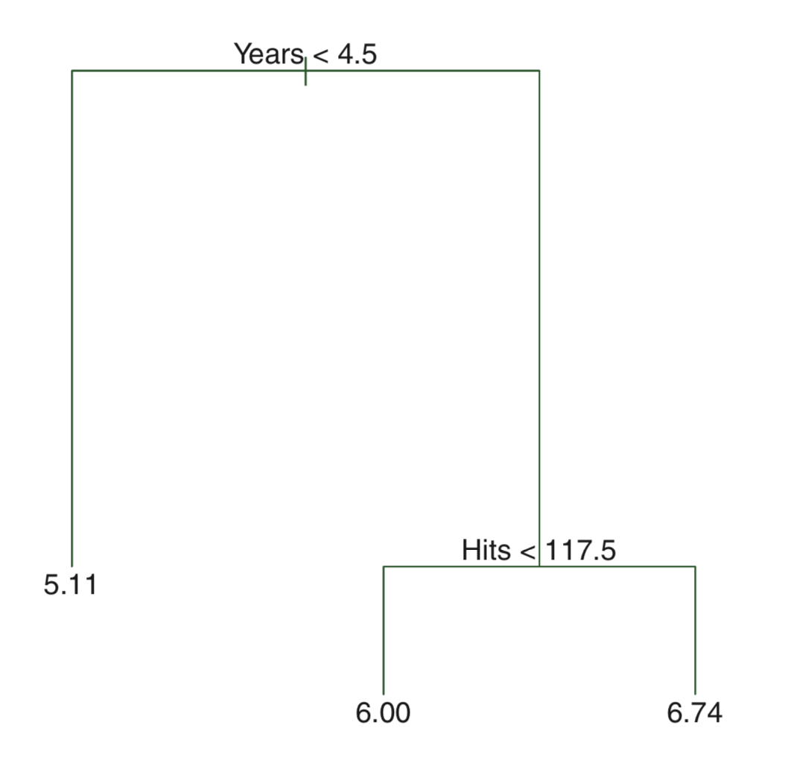
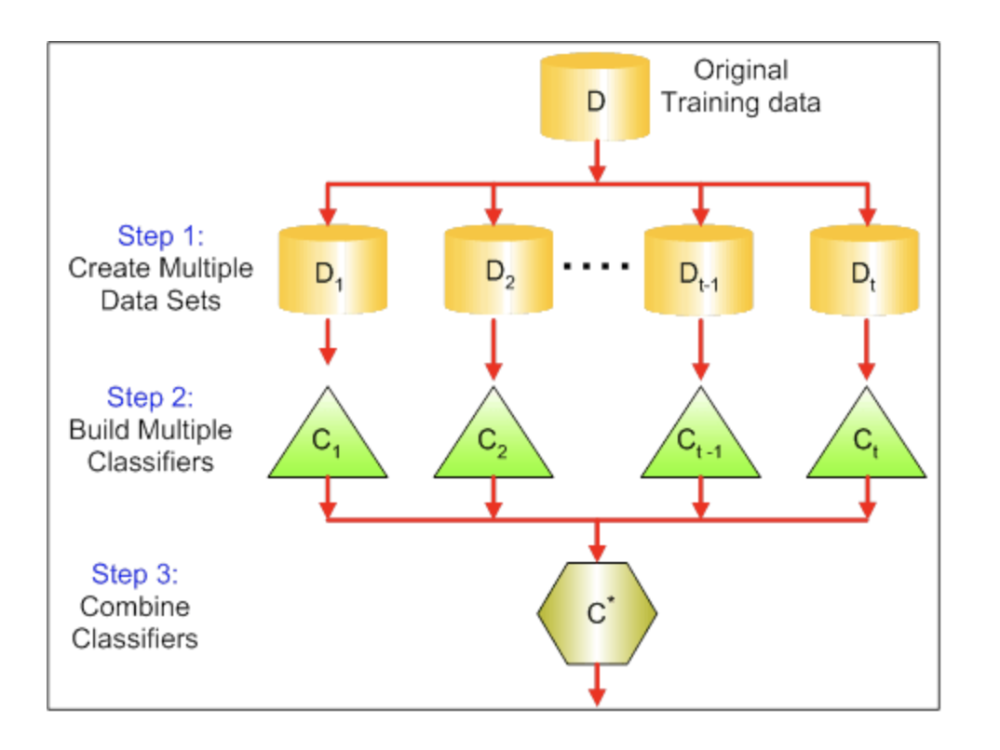

# Decision trees: regression  

설명변수 공간을 다수의 영역으로 분할하는 방법   
예측: 해당 관측치가 속하는 영역의 훈련 관측치들의 평균 (회귀) 또는 최빈값 (분류)을 사용한다.  




*advantage*  
- glass-box model   
- intuitive   


아래 식으로 주어진 RSS 를 최소로 하는 셜명변수 공간을 찾는 것이 목적   

$$\sum_{j=1}^J\sum_{i\in R_j}(y_i - \hat{y}_{R_j})^2$$

$R_j$: jth 설명변수 공간  
$\hat{y}_{R_j}$: jth 설명변수 공간에 속한 훈련 관측치 반응변수들의 평균값   


그러나.... 
설명변수 공간을 J개로 분할하는 모든 가능한 경우를 고려하는 것은 계산상 실현 불가능하다...  

**recursive binary splitting**  
- top-down   
- greedy   


*drawbacks*  
- greedy (short-sighted)     
- prone to overfitting   

*What "greedy" means?*  
Let's say currency including 25c, 15c and 1c coins,    
and develop an algorithm to make changes for 30c.     
final goal: using the smallest number of coins possible   
greedy algorithm: use the largest unit of coin    
greedy algorithm solution: 25 + 1 + 1 + 1 + 1 + 1 = 30c, with 6 coins   
optimal solution: 15 + 15 = 30c, with 2 coins   


**strategies to overcome drawbacks**   
*pruning*   
: 트리빌딩 초기 쓸모 없어 보이는 분할 이후에 아주 좋은 분할이 올 수 있다. 따라서, 더 나은 전략은 아주 큰 트리를 만든 다음에 그것을 다시 prune하여 subtree 를 얻는 것이다.     
그러나....   
모든 가능한 subtree 에 대해 교차 검증(혹은 검증셋 기법)을 이용하여 검정오차율를 추청하는 것은 너무 번거롭다. 대신, 우리는 고려할 작은 subtree 집합을 선택한다.    

**cost complexity pruning (weakest link pruning)**    
모든 가능한 subtree 를 고려하는 대신에 tuning parameter $\alpha$ (>=0) 에 의해 색인된 일련의 tree 들을 고려.    

각 $\alpha$ 값에 대해, 아래 식이 최소가 되는 subtree T 를 구할 수 있다.  

$$\sum_{j=1}^J\sum_{i\in R_j}(y_i - \hat{y}_{R_j})^2 + \alpha T$$ 

T: subtree T 의 number of terminal nodes   
$\alpha$: tuning parameter   

$\alpha = 0$일 때, subtree T = $T_0$   
$\alpha$가 증가함에 따라 많은 터미널 노드가 있는 트리의 경우 $\alpha T$ 항이 크게 증가할 것이므로 트리가 작을 때 위 식의 값이 최소로 되는 경향이 있다.   
즉, tuning parameter $\alpha$ 는 서브트리의 복잡도와 훈련자료에 대한 적합 사이의 trade-off 를 제어한다.   


k-fold CV 을 이용해서 검정오차를 $\alpha$의 함수로 평가하고, 평균 검정오차를 최소로 하는 $\alpha$를 선택.   


Linear model vs. Tree-based model 


load tree package   
```{r}
library(tree)
```


load MASS package to use Boston dataset   
make train dataset   
fit decision tree model to train dataset   
```{r}
library(MASS)
set.seed(1)
train = sample(1:nrow(Boston), nrow(Boston)/2)
tree.boston = tree(medv~., Boston, subset = train)
summary(tree.boston) # deviance: residual sum of square  
```

plot decision tree   
```{r}
plot(tree.boston)
text(tree.boston)
```

what are the stopping criteria?   
```{r}
?tree
?tree.control
```

pruning and cross-validation to set the optimal size of tree    
```{r}
cv.boston = cv.tree(tree.boston) # default K=10, cost complexity pruning
plot(cv.boston$size, cv.boston$dev, type = "b")
```

if you want a specific size of tree by pruning  
```{r}
prune.boston = prune.tree(tree.boston, best = 5)
plot(prune.boston)
text(prune.boston)
```


```{r}
predicted = predict(tree.boston, newdata = Boston[-train,])
observed = Boston[-train,]$medv
plot(predicted, observed)
abline(0,1)
mean((predicted-observed)^2)
```


# Decision trees: classification  

$\hat{p}_{mk}$: m번째 설명변수 공간 내 k class에 속하는 훈련 관측치들의 비율    
...이라고 할 때, 아래 분류오류율을 최소로 하는 것이 목적이다.   

$$E = 1 - \max(\hat{p}_{mk})$$

binary split 과정에서 분류오류율을 사용할 수 있지만...    
실제로는 node purity 에 더 민감한 아래 두 가지 척도를 주로 사용한다.     

- 지니 지수(Gini index)  
- 교차엔트로피(cross-entropy)   

Gini index: node purity 
$$G = \sum_{k=1}^{K} \hat{p}_{mk}(1-\hat{p}_{mk})$$

Cross-entropy   
$$D = - \sum_{k=1}^{K} \hat{p}_{mk}log(\hat{p}_{mk})$$  


```{r}
library(ISLR)
attach(Carseats)
High = ifelse(Sales<=8, "No", "Yes")
Carseats = data.frame(Carseats, High)
```

```{r}
set.seed(1)
train = sample(1:nrow(Carseats), 200)
test = Carseats[-train,]
tree.carseats = tree(High~.-Sales, data = Carseats, subset = train)
summary(tree.carseats)
```

```{r}
plot(tree.carseats)
text(tree.carseats, pretty = 0)
```

```{r}
tree.carseats
```

```{r}
pred.class = predict(tree.carseats, newdata = test, type = "class")
table(pred.class, test$High)
mean(pred.class == test$High)
```

cost complexity pruning and 10-fold CV
```{r}
set.seed(2)
cv.carseats = cv.tree(tree.carseats, FUN = prune.misclass)
```

```{r}
plot(cv.carseats$size, cv.carseats$dev, type = "b")
```

```{r}
prune.carseats = prune.misclass(tree.carseats, best = 5)
plot(prune.carseats)
text(prune.carseats, pretty = 0)
```

```{r}
tree.pred = predict(prune.carseats, test, type = "class")
table(tree.pred, test$High)
mean(tree.pred == test$High)
```


# Bagging 

aka bootstrap aggregation   
기계학습모델의 분산을 줄여 예측 정확도를 증가시키기 위한 범용 절차 (general-purpose procedure)   

$$\hat{f}_{bag}(x) = \frac{1}{B}\sum_{b=1}^{B}\hat{f}_b(x)$$ 
average for regression   
majority rule for classification   



배깅에 사용되지 않은 관측치들을 Out-of-bag (OOB) 관측치라고 함.   
**OOB 오차**  
: i번째 관측치에 대해 그 관측치가 OOB 이었던 각각의 트리를 이용하여 반응변수 값을 예측할 수 있다.  
: 교차검증 또는 검증셋 기법을 수행하기 힘든 규모가 큰 데이터셋에 대해 특히 편리함.   

**Variable importance** 
주어진 설명변수에 대한 분할로 RSS (or Gini index) 가 감소되는 총량을 모든 B개 트리에 대해 평균한 값이 크면 해당 설명변수가 중요하다고 할 수 있다.   

# Random Forest 
배깅에서와 마찬가지로 bootstrap 에 의해 다수의 트리를 만든다. 그러나, 배깅과 달리 트리 내에서 split 이 고려될 때마다 p개 설명변수들의 전체 집합에서 랜덤하게 m개 설명변수가 선택된다. 
rule of thumb, $m = \sqrt{p}$   

결국, 트리들 간의 상관성을 줄여, 분산을 줄이는 방법임.  


```{r}
library(randomForest)
set.seed(1)
bag.boston = randomForest(medv ~., data=Boston, subset=train, ntree=500, mtry=13, importance=T)
bag.boston
```

test set 에서의 성능
```{r}
predicted.bag = predict(bag.boston, newdata = Boston[-train,])
plot(predicted.bag, Boston[-train,]$medv)
abline(0,1)
mean((predicted.bag - Boston[-train,]$medv)^2)
```


```{r}
rf.boston = randomForest(medv ~., data=Boston, subset=train, ntree=500, mtry=6, importance=T)
rf.boston
```

```{r}
predicted.rf = predict(rf.boston, newdata = Boston[-train,])
plot(predicted.rf, Boston[-train,]$medv)
abline(0,1)
mean((predicted.rf - Boston[-train,]$medv)^2)
```

```{r}
importance(rf.boston)
```
%IncMSE: 주어진 변수가 모델에서 제외될 때 OOB 에서 예측 정확도의 평균 감소량   
IncNodePurity: 주어진 변수에 대한 분할로 인한 노드 purity 의 증가량(RSS의 감소량, deviance의 감소량)을 모든 트리에 대해 평균한 것  

```{r}
varImpPlot(rf.boston)
```

# Boosting 

여러개의 decision tree 를 만들어 결합하는데, 배깅과 달리 bootstrap 샘플링을 하지 않고, 대신...   
모든 훈련셋 자료를 이용하여 순차적으로... 
천천히... 
학습한다.   

Regression decision tree boosting   

1. $\hat{f}(x)$ = 0 이라 하고, 훈련셋의 모든 i에 대해 $r_i = y_i$ 로 설정한다. (r: residuals) 

2. b = 1,2,...,B 에 대하여 다음을 반복한다.   

- d개의 분할(d+1 터미널 노드)을 가진 트리 $\hat{f}^b$를 훈련자료 (X,r)에 적합한다.   

- 새로운 트리의 수축 버전을 더하여 $\hat{f}(x)$ 를 업데이트한다.   

$$\hat{f}(x) \leftarrow \hat{f}(x) + \lambda \hat{f}^b(x)$$

- 잔차들을 업데이트한다.   

$$r_i \leftarrow r_i - \lambda \hat{f}^b(x_i)$$

3. 부스팅 모델을 출력한다.   

$$\hat{f}(x) = \sum_{b=1}^B \lambda \hat{f}^b(x)$$

Boosting 의 tuning parameters   
- B: number of trees 
- $\lambda$: 수축 파라미터 (학습 속도를 제어)  
- d: number of split in each tree (boosting 의 복잡도를 제어) 


```{r}
library(gbm)
set.seed(1)
boost.boston = gbm(medv~., data = Boston[train,], distribution = "gaussian", n.trees = 5000, interaction.depth = 4) # shrinkage = 0.001
```

```{r}
summary(boost.boston)
```

partial dependence plot (PD plot)
```{r}
par(mfrow=c(1,2))
plot(boost.boston, i = "rm")
plot(boost.boston, i= "lstat")
```

```{r}
predicted.boost = predict(boost.boston, newdata = Boston[-train,], n.trees = 5000)
mean((predicted.boost - Boston[-train,]$medv)^2)
```


